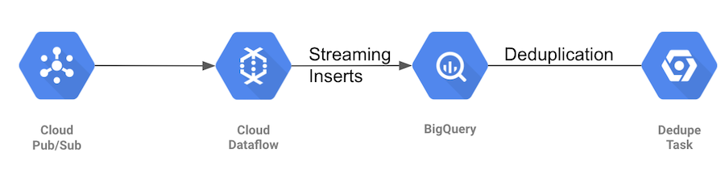

# Hedera ETL

[](https://travis-ci.org/blockchain-etl/hedera-etl)
[](https://hedera.com/discord)

Hedera ETL populates BigQuery dataset with transactions and records generated by the Hedera Mainnet (or Testnet, if so configured).
- Extract: Stream of transactions (and records) are ingested from a GCP PubSub topic
- Transform: Filters for important fields, formats data types, etc
- Load: Streaming insert into BigQuery dataset

## Overview



- PubSub topic contains JSON serialized hedera transactions published by
[Hedera Mirror Node](https://github.com/hashgraph/hedera-mirror-node). More details can be found [here](work-in-progress).

- Apache Beam pipeline pulls transactions from PubSub and inserts them into BigQuery. GCP Dataflow is used as runner for
the pipeline.

- Deduplication: The above ingestion pipeline gives at-least-once guarantee for persisting transaction into BigQuery.
Duplicates, if inserted, are removed using a deduplication task.

## Setup

### BigQuery

Schema for BigQuery table to store Hedera transactions is in
[schema.json](hedera-etl-bigquery/src/main/resources/schema.json) file. Please refer corresponding fields'
documentation in [hedera-protobuf](https://github.com/hashgraph/hedera-protobuf/tree/master/src/main/proto) for more
info about columns.

#### Creating tables

`bq` CLI is needed to create the tables. [/create-tables.sh](scripts/create-tables.sh) can be used to create all the
tables together. Alternatively, tables can be created individually using the commands below.

###### Transactions table

```bash
bq mk \
  --table \
  --description "Hedera network transactions" \
  --time_partitioning_field consensusTimestampTruncated \
  --time_partitioning_type DAY \
  --clustering_fields transactionType \
  project_id:dataset.transactions \
  hedera-etl-bigquery/src/main/resources/schema.json
```

###### Errors table

If an error is encountered when inserting a transaction into BigQuery, then the insert is retried. However, errors
for which retry would not help (for example, table row violating the schema), are not tried again and instead logged
into errors table.

```bash
bq mk \
  --table \
  --description "Hedera ETL Errors" \
  project_id:dataset.errors \
  hedera-etl-bigquery/src/main/resources/errors_schema.json
```

##### Deduplication state table
Deduplication task's state is stored in BigQuery table for persistence. That's because the task already relies on
BigQuery to be available, and adding dependency on a persistent volume or another database would be not as good.

```bash
bq mk \
  --table \
  --description "BigQuery deduplication task state" \
  --description "Hedera Dedupe " \
  project_id:dataset.dedupe_state \
  hedera-dedupe-bigquery/state-schema.json
```


### ETL to BigQuery

###### Requirements

1. BigQuery tables for transactions and errors should exist
2. PubSub topic should exist

For requirements to deploy on GCP Dataflow, refer [deployment](docs/deployment.md).

###### Common parameters

Configure GCP project id, PubSub subscription/topic, and BigQuery tables.

```bash
PROJECT_ID=... # Set your project id
SUBSCRIPTION=projects/${PROJECT_ID}/subscriptions/subscriptionName
TRANSACTIONS_TABLE=${PROJECT_ID}:dataset.transactions
ERRORS_TABLE=${PROJECT_ID}:dataset.errors
```

#### Running locally

```bash
cd hedera-etl-bigquery

mvn compile exec:java -PdirectRunner -Dexec.args=" \
  --inputSubscription=${SUBSCRIPTION}, \
  --outputTransactionsTable=${TRANSACTIONS_TABLE}, \
  --outputErrorsTable=${ERRORS_TABLE}"
```

#### Running on GCP Dataflow

1. Setup GCS bucket which is used for staging, templates, and temp location.

```bash
BUCKET_NAME=... # Set your bucket name
PIPELINE_FOLDER=gs://${BUCKET_NAME}/pipelines/etl-pipeline
```

2. Build and upload template to GCS bucket

```bash
cd hedera-etl-bigquery

mvn compile exec:java \
 -Dexec.args=" \
 --project=${PROJECT_ID} \
 --stagingLocation=${PIPELINE_FOLDER}/staging \
 --tempLocation=${PIPELINE_FOLDER}/temp \
 --templateLocation=${PIPELINE_FOLDER}/template \
 --runner=DataflowRunner"
```

3. Start Dataflow job using the template

```bash
gcloud dataflow jobs run etl-pipeline-`date +"%Y%m%d-%H%M%S%z"` \
 --gcs-location=${PIPELINE_FOLDER}/template \
 --parameters "inputSubscription=${SUBSCRIPTION},outputTransactionsTable=${TRANSACTIONS_TABLE},outputErrorsTable=${ERRORS_TABLE}"
```
Controller service account can be configured by adding
`--service-account-email=my-service-account-name@<project-id>.iam.gserviceaccount.com`. See
[Controller service account](https://cloud.google.com/dataflow/docs/concepts/security-and-permissions#controller_service_account)
for more details.

### Deduplication

Deduplication task trails the transactions table to ensure that two rows never have same consensusTimestamp. Due to
at-least once guarantee of PubSub and Hedera Mirror Node (publishing to pubsub), it's possible that in rare cases,
single transaction gets inserted more than once. Deduplication task removes these duplicates to ensure exactly-once
guarantee. See class comments on [DedupeRunner](hedera-dedupe-bigquery/src/main/java/com/hedera/dedupe/DedupeRunner.java)
for more details.

## More documentation
[Deployment](docs/deployment.md)

## Code of Conduct
This project is governed by the [Contributor Covenant Code of Conduct](CODE_OF_CONDUCT.md). By participating, you are
expected to uphold this code of conduct. Please report unacceptable behavior to [oss@hedera.com](mailto:oss@hedera.com).

## License
[Apache License 2.0](LICENSE)
