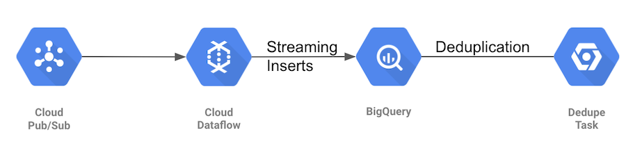

# Hedera ETL

[](https://travis-ci.org/blockchain-etl/hedera-etl)
[](https://hedera.com/discord)

Hedera ETL populates BigQuery dataset with transactions and records generated by the Hedera Mainnet (or Testnet, if so configured).
- Extract: Stream of transactions (and records) are ingested from a Google Cloud Storage Bucket
- Transform: Filters for important fields, formats data types, etc
- Load: Streaming insert into BigQuery dataset

## Overview



- Record Files contains Protobuf serialized hedera transactions published by
[Hedera Mirror Node](https://github.com/hashgraph/hedera-mirror-node). More details can be found [here](work-in-progress).

- Apache Beam pipeline pulls Record Files from Google Cloud Storage and inserts them into BigQuery. GCP Dataflow is used as runner for
the pipeline.

## Setup

### BigQuery

Schema of BigQuery tables is for now managed by Apache Beam. It will be managed by Terraform in near future.

#### Creating tables

`terraform` CLI will be needed to create the tables. [terraform apply](scripts/create-tables.sh) can be used to create all the
tables together.

### ETL to BigQuery

###### Requirements

Cloud infrastructure for ETL should exist before deployment.

For requirements to deploy on GCP Dataflow, refer [deployment](docs/deployment.md).

###### Common parameters

Configure GCP project id and cloud infrastructure.

```bash
gcloud auth application-default login
terraform -chdir=terraform init
terraform -chdir=terraform apply
```

#### Running from local machine

```bash
./gradlew run --args=" \
--ingestionDate=2024-01-01 \
--inputBucket=<bucket with your data>
--outputDataset=<your output dataset> \
--runner=DataflowRunner \
--project=mystical-being-444413-n9 \
--region=europe-central2 \
--tempLocation=gs://<your dataflow staging bucket>/temp/ \
"
```

Extra arguments:
- `--inputPathPattern=<uri pattern>`: you can force pipeline to read data matching some specific custom pattern,
  e.g. `--inputPathPattern=gs://test-input/test-record*/*.rcd.gz` would force pipeline to read `.rcd.gz` files matching
  any `test-record` prefix in GCS bucket `test-input`.
- `--disableMergeHistoryInput=true`: some records require tracking their state. If you don't require to do that, you can disable it using this option.

#### Running on GCP Dataflow

1. Setup GCS bucket and Docker repository which is used for staging, templates, and temp location.

```bash
DOCKER_IMAGE=... # Set your docker name
TEMPLATE_FILE=gs://... # Set your template file name
```

2. Build and upload template to GCS bucket

```bash
./gradlew deployFlexTemplate \
 -Pflex.dockerImage=$DOCKER_IMAGE \
 -Pflex.templateFile=$TEMPLATE_FILE
```

3. Start Dataflow job using the template

```bash
gcloud dataflow flex-template run \
 etl-bigquery-`date +"%Y%m%d-%H%M%S%z" \
 --template-file-gcs-location=$TEMPLATE_FILE \
 --region=europe-west1 \
 --max-workers=5 \
 --parameters=ingestionDate=`date +"%Y-%m-%d",inputBucket="<bucket with your data>",outputDataset="<your output dataset>",tempLocation="gs://<your dataflow staging bucket>/temp/"
```
Controller service account can be configured by adding
`--service-account-email=my-service-account-name@<project-id>.iam.gserviceaccount.com`. See
[Controller service account](https://cloud.google.com/dataflow/docs/concepts/security-and-permissions#controller_service_account)
for more details.

## More documentation
[Deployment](docs/deployment.md) \
[Configurations](docs/configurations.md)

## Code of Conduct
This project is governed by the [Contributor Covenant Code of Conduct](CODE_OF_CONDUCT.md). By participating, you are
expected to uphold this code of conduct. Please report unacceptable behavior to [oss@hedera.com](mailto:oss@hedera.com).

## License
[Apache License 2.0](LICENSE)
